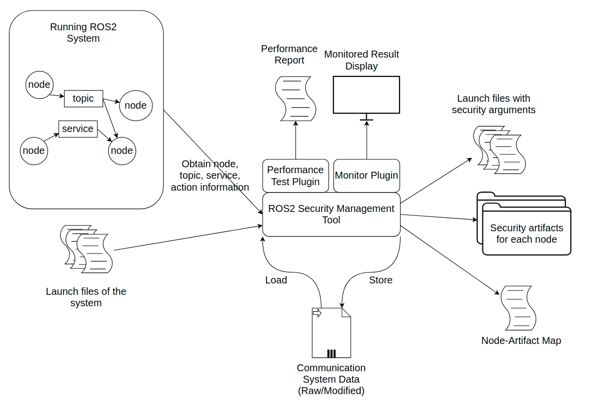

# ROS2-SMT
ROS2 Security Management Tool (ROS2-SMT) aims at making easier the configuration to enable ROS2 security in complex ROS2 system. The main functions it provides include automatically detect and record the existing nodes in the system, automatically analysis node relationship and automatically generate corresponding security artifacts. In addition, it will provide the function to monitor the secure ROS2 system and perform the performance analysis(currently the entire system is under developing)

# Usage
## 1. Build ROS2-SMT in pre-config docker container
   You should first have [Docker](https://docs.docker.com/engine/install/ubuntu/) installed on you PC. Then you can find ROS2-SMT docker image with:
   ```bash
    $ docker pull rexyyj/ros2-smt:0.1.1
   ```
   Then, you can run container according to the network configuration of the existing ROS2 system and run ROS2-SMT.
   ```bash
   # When ROS2 system to be scan is under host PC's network and map /smt_keystore in docker container to host's ~/smt_keystore(or other directory you prefer)
    $ docker run -it --network host -v ~/smt_keystore:/smt_keystore rexyyj/ros2-smt:0.1.1
    $ source env.sh
    $ ros2 run ros2_smt smt_run

   ```
   
   
## 2. Build ROS2-SMT form source
These instructions are tested under Ubuntu 20.04 system
1. Install souce-built ROS2 foxy in your system
2. Install openjdk-8-jdk and openjdk-8-jre 
3. Install argparse, pyspark and graphframes with pip3
4. clone ROS2-SMT with:
   ```bash
   git clone --recursive https://github.com/Rexyyj/ROS2-SMT.git
   ``` 
5. Build ROS2-SMT with colcon

# Design

In the design of ROS2-SMT, it will be able to perform the following functions:
1. This tool will obtain the existing communication relationship from the environment when the communication is not secured.(Node, Topic, Service, Relationship)
2. This tool will save the obtained information and possible to visualize, update and optimize the relationship in future analysis.
3. This tool will analysis the relationship of the communicating entities and group them to different groups according to the security level setting.
4. This tool will create security artifacts for each group and generate a document indicating corresponding artifact to each node.
5. This tool will modify the launch file of nodes according to the document in 4.
6. This tool will be able to obtain information from the security system once it have necessary information of the security system (CA certificates)
7. This tool will be able to analysis the performance change before and after enabling security in communication.


# Roadmap
* Current stage
  * 2021.04-2021.08 --> Prove of basic idea

* Future stage
  * Pending...